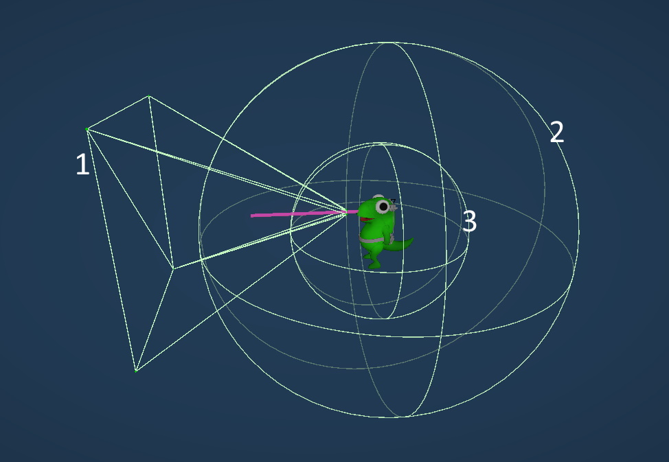

## Disco-Gecko
## Table of contents
- [What is this repository ?](#what-is-this-repository-)
- [General](#general)
  - [The pitch](#the-pitch)
  - [Context](#context)
  - [Credits](#credits)
- [My work on this project](#my-work-on-this-project)
  - [Features](#features)
- [Challenges](#challenges)
  - [Challenge 1 : Local, Online and both at the same time gameplay](#challenge-1--local-online-and-both-at-the-same-time-gameplay)
  - [Challenge 2 : A large crowd that the player has to navigate](#challenge-2--a-large-crowd-that-the-player-has-to-navigate)
  - [Challenge 3 : A physics-based tongue for interactions](#challenge-3--a-physics-based-tongue-for-interactions)
    - [The sensors of the tongue system](#the-sensors-of-the-tongue-system)
    - [Showcase of the tongue's features](#showcase-of-the-tongues-features)
- [What could be improved](#what-could-be-improved)
- [Gallery](#gallery)

## What is this repository ?
This repository is the public version of the source code of my Master 1 Game : Disco-Gecko (was SilentNightFever), it's the public version because I have trimmed all paid Plugins that should not be in the public repository.

IT WON'T COMPILE (Because there is a lot of missing plugins)

## General
### The pitch
Reptiles, lights and an 80’s glitter !

DISCO GECKO is a 2v2 party game where you’re lost in a huge jungle night club and have to find your friend ! Use your tongue and the environment to get in the way of the opposite team… and be the first two geckos to kiss !!

DISCO GECKO is playable only with 4 players, ON SITE or ONLINE !

After a short onboarding phase, the game will start. In order to win, a team has to succed 3 rounds (you can change the number of rounds in the settings menu!). The first duo to find eachother and kiss win the round !

But be careful ! The north can't help you : all cameras angles are randomized every round. Some usable landmarks will help you, while others will allow you to sabotage the other team...

To find yourself, you will have to memorize the environment around you and communicate with your friend !

### Context
This game was made in 4 month between March 2024 and July 2024 by a Team of 8 people and 2 freelance composers during my Master's degree 1st year project.
Some members of the team were part-time on this project. I was full-time on it.

### Credits
Aurore BERTHET, Producer

Margot THETIOT, UX Designer & User Researcher

Tom D'EXPORT, Online & Gameplay Programmer _(that's me)_

Tristan BADANA, Generalist Programmer

Patxi M. GONZALEZ, Game Designer & 2D Artist

Hugo SANNIER-DURAND, Sound Designer

Jules GIBERT, Game Art

Mahé LETTELIER, Concept Artist & Animator

and

Foucauld DESROUSSEAUX & Clara ROTTI, composers

## My work on this project
I was the Online and Gameplay Programmer of this project, I also did the UI. I did not code the Procedural Generations, but I contributed to networking it.

You can find all of my scripts at the path `Assets/_Project/Scripts`

### Features
Here is a non-exhaustive list of features I made :
- Multiplayer
  - Networking with Fishnet
  - Local, Online and both at the same time gameplay
  - Tools for testing multiplayer features locally
    -  Inputs are provided via an interface IInputProvider
    -  In editor, the developer can possess other characters by switching the character that is provided by the inputs
    -  There is a class that can record inputs and replay them as if it was a real player for multiplayer interactions testing on the same computer
  - Unity Gaming Services integration
    - Players can create and join lobbies with a join code
    - We use the Unity Transport Integration for Fishnet : https://github.com/ooonush/FishyUnityTransport
- Procedural Generation
- Character's tongue are physics-based
  - Players can pull each other
  - Players can stick their tongue at objects to interact with them (pull, push, press)
- World-Space UI with replicated menus for the lobby

## Challenges
Disco Gecko was a technical challenges on multiple features 
1. Local, Online and both at the same time gameplay
2. A large crowd that the player has to navigate
3. A physics-based tongue for interactions

### Challenge 1 : Local, Online and both at the same time gameplay
This game is split-screen, it's meant to be a 4-player couch game, but also an online game...or both at the same time.
It means that you can have any of these configuration : 4 player on the same device, 4 player on 4 device, 4 players on 2 device, etc...

My goal was to code the game so that the code was not different for real online gameplay and local gameplay, 
it meant being online by default and carefully architecture players inputs so that at the end the same code was used. 

The first thing I did to solve this technical challenge was to represent each player by two things :
- Their client ID
- Their device they use to send input to Unity
- Their location on the screen (since the screen is split in 4 square, I identity them by A,B,C,D from the upper left corner to the lower right corner)

The code of the script that represent a player ([Assets/_Project/Scripts/Runtime/Player/RealPlayerInfo.cs](Assets/_Project/Scripts/Runtime/Player/RealPlayerInfo.cs))
```cs
/// <summary>
/// This struct represent a Real player since our game can have multiple players on the same client
/// We should have four of these, one for each player
/// The PlayerManager should create all four players from these infos
/// </summary>
[Serializable]
public struct RealPlayerInfo
{
    public byte ClientId;
    public PlayerIndexType PlayerIndexType;
    public string DevicePath;
}

[Serializable]
public enum PlayerIndexType
{
    A, // upper left player
    B, // upper right player
    C, // lower left player
    D, // lower right player
    Z // Z == not set yet
}
```

The player index type is used extensively in the project, for example, prefab that was meant to exist for each player were called "ExamplePrefab_Z".
Inside the RealPlayerInfo we also replicate a string for the DevicePath, string can consumes a lot of bandwidth but since it's a list of four RealPlayerInfo 
replicated during the joining phase but doesn't change during the rest of the game we assume it's ok.

This code is the base architecture of the whole project and has worked well for our needs. 
Each time there is an input, we get the associated DevicePath and we can differentiate between local players easily.

### Challenge 2 : A large crowd that the player has to navigate
Crowds are known to be difficult to create in games for multiple reasons, but one the main thing is performance.
When a game starts, the procedural generation happens and just after that we spawn every NPC, around 1300 of them.

That is a lot of NPCs, but for us it was even worse because we had four cameras, all rotated at different angles at the start of each round.
When we first tested the crowd with the final character and not placeholder capsule, the game was unplayable with a frame time of ~35 ms (29 FPS).

FPS was a problem but the other issue was that at first in the game's design, the NPCs in the crowd were interacting with players (dancing, following, throwing their tongue, etc...)
and since our game was online it meant replicating all of this NPCs, due to time constraints and performance, we scrapped that idea.

Since the NPCs were not directly interacting with the players anymore, I tried to scrap the most amount of performance as possible with :
- Asking our artistic team for a version of the Character with less bone and less polys than the Player's one (it worked quite well, now our frame time was ~30 ms so 33 FPS)
- Implementing distance based culling that would totally disable the NPC's gameobject (frame time was now  ~28.2ms so 35.4 FPS)

Due to time constraints, this is the only optimisations we tried, with more time we could have explored solutions with DOTS ECS, or making the animations with shader instead of using the built-in animator.

### Challenge 3 : A physics-based tongue for interactions
What's one of the worst thing you can combine with an online game ? Physics !
Early in the development, the team decided that the main characters of the game would be Geckos, and thus,
the idea of having the Gecko interacting with its environment with their tongue was suggested.
One of the first thing I tested was to make a real physics-based tongue using an Unity plugin to simulate a rope ([Obi Rope](https://assetstore.unity.com/packages/tools/physics/obi-rope-55579?srsltid=AfmBOorwtYpKUIvK3BSZdcTCxvMs7aaQw_ISrfTv7nVd5xGT993HV4Bj)).
It worked well locally, but things started to get complicated when networking this system. First let's see the final version of this system.
#### The sensors of the tongue system
The system is composed of 3 sensors :
1. FOV Sensor : This is a sensor that is always facing in front of the player, it goes far and require the player to be precise
2. Aim Assist Sensor : This is the sensor that replace the FOV Sensor when the accessibility feature "Aim Assist" is activated _(or ApplicationSettings.UseRadialTongueSensor in the code)_, it enables the player to be less precise
3. Close Sensor : This is a sensor that is always activated, and is used to make it easier to kiss your ally when you are close to them, it only detects your ally


#### Showcase of the tongue's features
[](https://youtu.be/0vD_-j-0rPU "Disco Gecko Tongue System Showcase")

## What could be improved

## Gallery